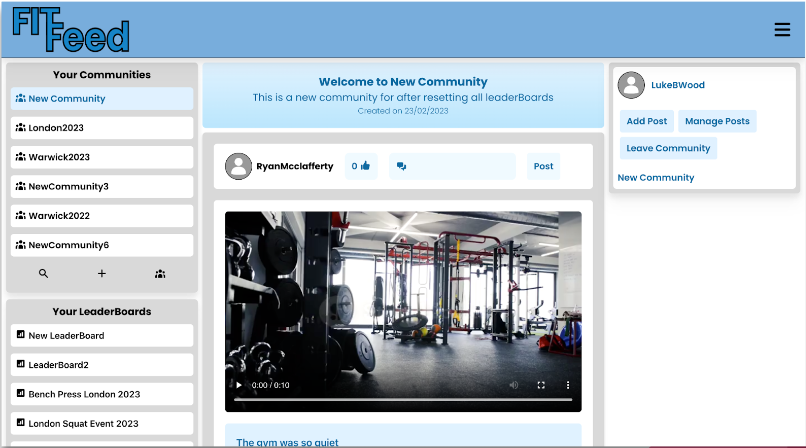
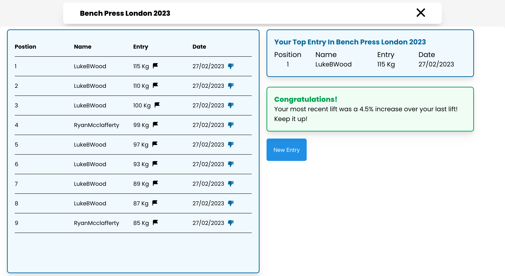
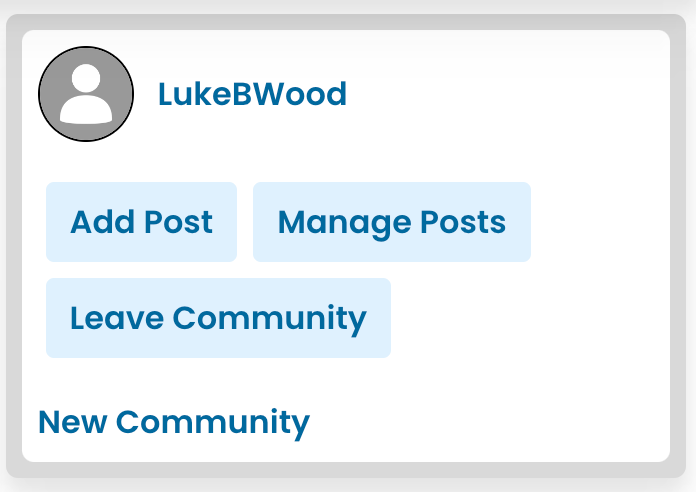
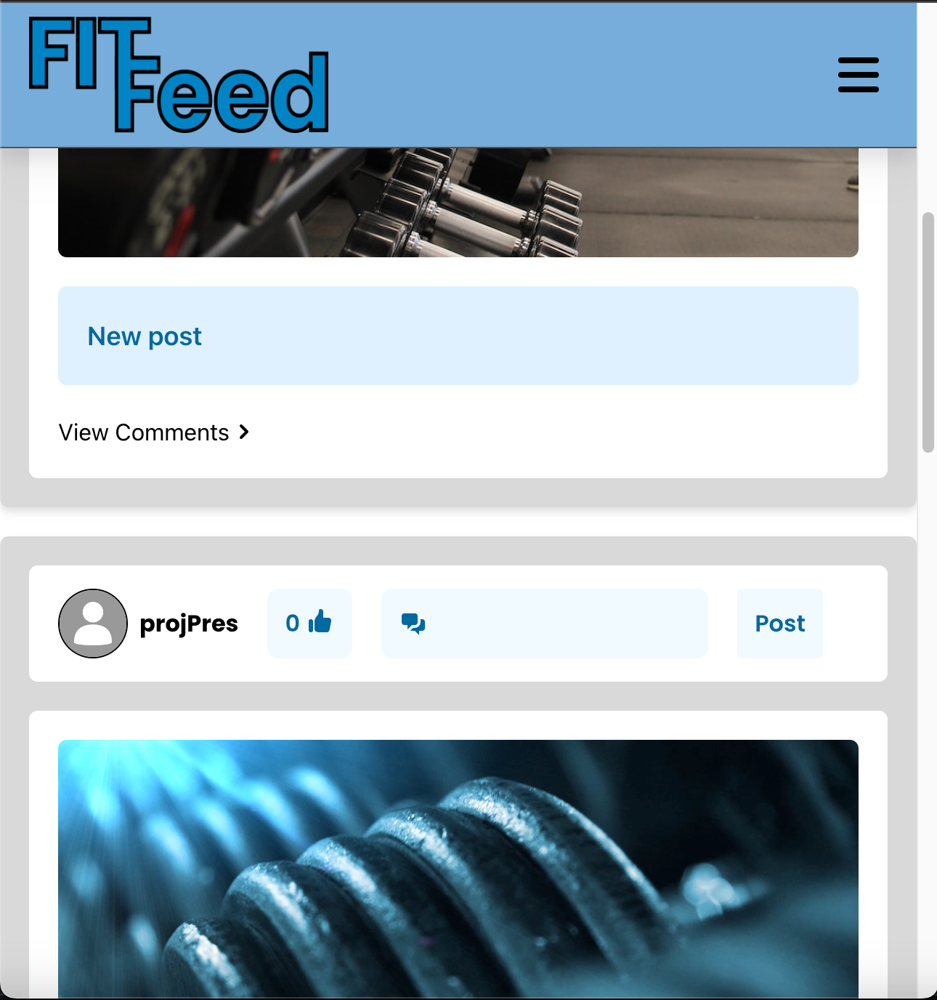

# Gym Social Network

This repository contains the source code for my final year dissertation project in which I created a full-stack social network for gym-users and fitness enthusiasts.

The project was built using the MERN stack (MongoDB, Express, React, Node). The backend was built by creating an ExpressJs API and connecting to MongoDb using Mongoose. The
frontend was built using React and corresponding libraries such as Redux.

# Main Page
This page is the main dashboard for users to see posts and interact with their communities.

# Communities and Leader Boards
Users can join communities based on their gym or personal groups with their friends.

Within these communities, there are posts and leader boards. Using leader boards users can compete within their communities.

# Using components

Using React, designing UI components is very simple.

# Responsiveness

To cater to all demographics, responsive design is very important. Using tailwind this is extremely easy. I tried to make mobile views for each page.

